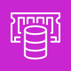
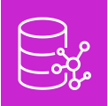
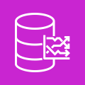

## Redshift

\#aws-service   
 **Redshift** is a petabyte-size data-warehouse. 

* Data-warehouses are for Online Analytical Processing (OLAP).
* Data-warehouses can be expensive because they are keeping data "hot"
  * Meaning that we can run a very complex query and a large amount of data and get that data back very fast

## ElastiCache

\#aws-service   
  **ElastiCache** is a managed database of the *in-memory* and *caching* open-source databases

* ==Redis== or ==Memcached==

 > 
 > \[!abstract\] Purpose  
 > *When you need to improve the performance of an application by adding a caching layer in-front of a web-server or database*

## Neptune

\#aws-service   
 **Neptune** is a managed graph database. 

* Database is represented as interconnected nodes

 > 
 > \[!abstract\] Purpose  
 > *When you need to understand the connections between data*

 > 
 > \[!example\]  
 > Mapping Fraud Rings or Social Media Relationships

## Amazon Timestreams

  **Amazon Timestreams** is a fully managed time series database. 

* Think of devices that send lots of data that are time-sensitive such as IoT devices.
* When you need to measure how things change over time.
