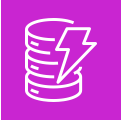
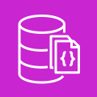
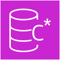

## DynamoDB

  **DynamoDB** is a serverless ==NoSQL key/value and document database.== 

* It is designed to scale to <mark style="background: #FF5582A6;">billions of records</mark> with guaranteed consistent data return in at least a second. 
* You don't have to worry about managing shards!
* DynamoDB is AWS's *flagship database service* meaning whenever we think of a database service that scales, is cost effective and very fast DynamoDB da way to go

In 2019, Amazon shutdown their last Oracle database and completed their migration to DynamoDB. They had 7,500 Oracle Databases and 75 petabytes of data. With DynamoDB they reduce costs by 60% and reduce latency by 40%.

## DocumentDB

\#aws-service   
 **DocumentDB** is a NoSQL <mark style="background: #FF5582A6;">document</mark> database that is "MongoDB compatible"

* MongoDB is a very popular NoSQL among developers. They were open-source licensing issues around using open-source MongoDB, so AWS got around it by just building their own MongoDB database.
* *When you want a MongoDB database.*

## Amazon Keyspaces

\#aws-service   
 **Amazon Keyspaces** is a fully managed Apache Cassandra database. 

* Cassandra is an open-source NoSQL key/value database similar to DynamoDB in that is columnar store database but has some additional functionality.
* *When you want to use Apache Cassandra*
