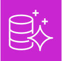
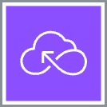
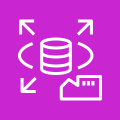

 **Relational Database Service (RDS)** is a ==relational database service== that supports multiple SQL engines. Relational is synonymous with SQL and Online Transactional Processing (OLTP). Relational database are the <mark style="background: #FF5582A6;">most commonly used type of database</mark>  among tech companies and start-ups. #aws-service 

RDS Supports the following SQL Engines:

* **MySQL** - The most popular open-source SQL database that was purchased and now owned by Oracle.
* **MariaDB** - When Oracle bought MySQL, MariaDB made a fork (copy) of MySQL under a different open-source license.
* **Postgres (PSQL)** - Most popular open-source SQL database among developers. Has rich-features over MySQL but at added complexity.
* **Oracle** - Oracle's proprietary SQL database. Well used by Enterprise companies. You have to buy a license to use it.
* **Microsoft SQL Server** - Microsoft's proprietary SQL database. Need a license.
* **Aurora** - Fully managed database. 

 **Aurora** is a fully managed database of either MySQL (5x faster) and PSQL (3x faster) database #aws-service 

 > 
 > \[!abstract\] Purpose  
 > *When you want a highly available durable, scalable, and secure relational database for Postgres or MySQL*

 +  **Aurora Serverless** is the ==serverless on-demand version of Aurora.== #aws-service 

 > 
 > \[!abstract\] Purpose  
 > *When you want "most" of the benefits of Aurora but can trade to have cold-starts or you don't have lots of traffic demand*

 **RDS on VMware** allows you to deploy RDS supported engines to an on-premise data-center. The datacenter must be using VMware for server virtualization. #aws-service 

 > 
 > \[!abstract\] Purpose  
 > *When you want a database managed by RDS on your own datacenter*
