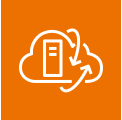

## What is Edge Computing

When you push your computing workloads outside of your networks to run close to the destination location 

 > 
 > \[!example\]  
 > Pushing computing to run on phones, IoT Devices, or external servers not within your cloud network.

## What is Hybrid Computing?

When you're able to run workloads on both your on-premise datacenter and AWS Virtual Private Cloud (VPC)

## Services

````
![[AWS Cloud Practitioner/3 Global Infrastructure/3-11 Outposts#^77fd59|3-11 Outposts]]
````

* AWS Outposts is a ==physical rack of servers== that you can put in your data center. 
* AWS Outposts allows you to use AWS API and Services such as EC2 right in your datacenter.

 **AWS Wavelength Zones** allows for [edge-computing](7-4%20Edge%20and%20Hybrid%20Computing%20Services.md#what-is-edge-computing) on 5G Networks.  
Applications will have ultra-low latency being as close as possible to the users. #aws-service

* AWS Wavelength allows you to ==build and launch your applications in a telecom datacenter.==
* By doing this your application will have ultra-low latency since they will be pushed over a 5G network and be close as possible to then end user. 

### VMWare Cloud on AWS

  **VMWARE Cloud on AWS** allows you to ==manage on-premise virtual machines using VMWare== as EC2 instances. The data-center must be using VMWare for Virtualization. #aws-service 

### AWS Local Zones

 ** AWS Local Zones\*\* are ==edge datacenters located outside of an AWS region== so you can use AWS closer to the end destination. #aws-service 

 > 
 > \[!abstract\] Purpose  
 > <em style="color:#b5b5b5">When you need faster computing, storage and databases in populated areas that are outside of an AWS Region</em>
